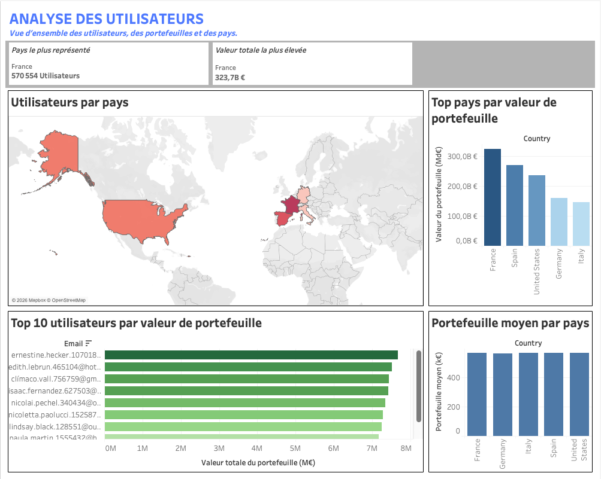
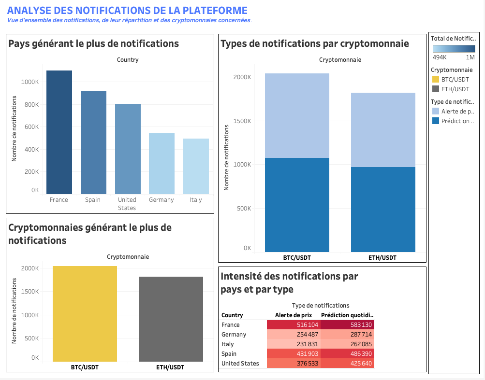
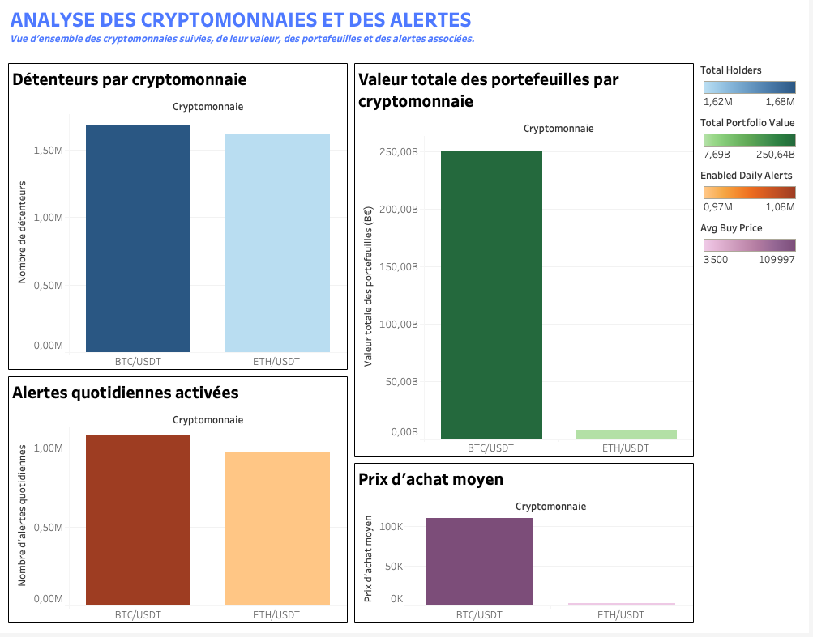

# Crypto Alerts

> Plateforme de **Data Engineering & Analytics Engineering** reproduisant une architecture de production capable de collecter des données historiques et temps réel, d'alimenter des pipelines analytiques et de Machine Learning, puis de générer des prédictions quotidiennes et des alertes personnalisées.


 


## **Pourquoi ce projet ?**

Crypto Alerts a été conçu pour reproduire une plateforme de données de production couvrant l'ensemble du cycle de vie de la donnée : collecte, stockage, transformation, analyse, prédiction et restitution.

Le projet combine ingestion batch et temps réel, orchestration, automatisation, modélisation analytique, Machine Learning, API REST, monitoring, génération d'alertes.

## **Ce que fait la plateforme**

- Collecte des **données** historiques avec CCXT
- **Streaming** temps réel via WebSocket
- Stockage **PostgreSQL**
- Feature Engineering des données de marché
- Entraînement et prédiction Machine Learning
- Génération d'alertes personnalisées
- Modélisation analytique avec **dbt**
- **Orchestration** des pipelines avec **Airflow**
- Exposition des données via **FastAPI**
- Visualisation opérationnel avec Streamlit
- Visualisation analytique avec **Tableau**


## **Architecture**

Le diagramme suivant présente les principaux composants de la plateforme ainsi que les flux de données entre les différents services.

<p align="center">
  
</p>

L'architecture repose sur deux pipelines complémentaires :

- **un pipeline batch**, chargé de collecter les données historiques, de construire les indicateurs techniques, d'entraîner les modèles de Machine Learning et de générer les prédictions quotidiennes ;
- **un pipeline temps réel**, chargé de surveiller en continu les prix des cryptomonnaies et de déclencher les alertes personnalisées lorsque les conditions définies par les utilisateurs sont remplies.


##  **Démonstration**

<p align="center">
  <a href="assets/gif/streamlit.gif">
    
  </a>
  <br>
  <b>Dashboard Streamlit</b>
</p>

<p align="center">
  <a href="assets/gif/airflow.gif">
    
  </a>
  <br>
  <b>Pipelines Airflow</b>
</p>

### Dashboards Tableau

<p align="center">
  <a href="assets/images/mart_users.png">
    
  </a>
  <br>
  <b>Analyse des portefeuilles utilisateurs</b>
</p>

<p align="center">
  <a href="assets/images/mart_notifications.png">
    
  </a>
  <br>
  <b>Analyse des notifications de la plateforme</b>
</p>

<p align="center">
  <a href="assets/images/mart_crypto.png">
    
  </a>
  <br>
  <b>Analyse des cryptomonnaies et des alertes</b>
</p>


## **Choix d'architecture**

Les principaux choix d'architecture sont les suivants :

- **PostgreSQL** centralise les données opérationnelles et permet d'exécuter les traitements **SQL** au plus près des données.
- **Airflow** orchestre les pipelines de collecte, de transformation, d'entraînement et de prédiction.
- **dbt** construit une couche analytique réutilisable et indépendante de la base opérationnelle.
- **FastAPI** expose les données, les prédictions et les métriques via une API REST documentée automatiquement.
- **Streamlit** fournit un tableau de bord opérationnel pour le suivi de la plateforme en temps réel.
- **Tableau** exploite la couche analytique afin de produire des tableaux de bord orientés métier.
- **Prometheus** collecte les métriques des différents services, tandis que **Grafana** assure leur supervision et leur visualisation.
- **Docker Compose** permet de reproduire l'ensemble de l'environnement de développement avec une seule commande.

Cette architecture favorise la séparation des responsabilités, améliore la maintenabilité de la plateforme et facilite son évolution.

## **Observabilité et visualisation**

Afin de proposer une plateforme de données complète, le projet intègre également :

- **Streamlit** fournit une interface opérationnelle permettant de suivre les données de marché, les prédictions, les notifications et les principaux indicateurs de la plateforme.
- **Tableau** permet d'explorer les données métier à travers des tableaux de bord analytiques (répartition des utilisateurs, composition des portefeuilles, statistiques d'utilisation, etc.).
- **Prometheus** collecte les métriques des différents services.
- **Grafana** supervise la plateforme et visualise les métriques techniques.

## **Qualité logicielle**

Le projet applique plusieurs bonnes pratiques afin d'améliorer sa fiabilité.

- **Pytest** pour les tests unitaires et d'intégration.
- **GitHub Actions** pour automatiser les tests et valider le projet à chaque Push ou Pull Request.


## **Points techniques**

- Pipelines ETL / ELT modulaires
- Collecte incrémentale
- Traitements SQL-first
- Batch processing
- Optimisation PostgreSQL (`INSERT ... SELECT`, `ON CONFLICT DO NOTHING`, `FOR UPDATE SKIP LOCKED`)
- Couche analytique avec **dbt**
- DAGs **Airflow** indépendants
- Architecture en services découplés
- API REST documentée avec OpenAPI


## **Scalabilité**

Le projet a été conçu pour gérer des volumes importants de données.

Tests réalisés :

- Génération de **2 000 000 d'utilisateurs** en environ **13 minutes** grâce au batch processing
- Plusieurs **millions d'alertes** de prix
- Pipelines indépendants
- Aucun chargement massif des alertes en mémoire Python
- Plateforme entièrement conteneurisée


## **Évolutions prévues**
- Déploiement Cloud
- Validation automatique des modèles
- Notifications Email et SMS
- Authentification JWT
- Amélioration de la couverture de tests
- Amélioration de Dbt

## **Stack technique**

- Python
- PostgreSQL
- Docker Compose
- Airflow
- dbt
- FastAPI
- Streamlit
- Tableau
- Prometheus
- Grafana
- GitHub Actions
- Pytest
---


## **Lancer le projet**

### 1. Configuration

Les fichiers de configuration `.env` ne sont pas versionnés et sont exclus du dépôt via `.gitignore`.

Avant de lancer le projet, créer les fichiers `.env` à partir des modèles fournis :

```bash
cp .env.example .env
cp .env.docker.example .env.docker
```

Modifier ensuite les variables d'environnement selon votre configuration si nécessaire.

### 2. Démarrer l’environnement Docker

Cette commande lance les services principaux du projet et initialise automatiquement les tables de la base PostgreSQL.

```bash
docker compose --env-file .env.docker build --no-cache
docker compose --env-file .env.docker up -d
```
Vérifier que les tables se sont bien crées: 
```bash
docker logs crypto_init_db 
```
"Base de données initialisée avec succès."

### 3. La génération des utilisateurs se fait manuellement : 
```bash
docker compose --env-file .env.docker run --rm pipeline python users_db/generate_fake_users.py <nombre d'utilisateurs souhaités>
```
```bash
Exemple:
docker compose --env-file .env.docker run --rm pipeline python users_db/generate_fake_users.py 2000000
```

### 4. Accéder à l'interface Airflow afin lancer le dag "setup" pour Collect > Features > Train > Predict

http://localhost:8080

### 5. La partie analytics est optionnelle. Pour lancer dbt : 
```bash
docker compose --env-file .env.docker --profile manual run --rm dbt dbt debug
docker compose --env-file .env.docker --profile manual run --rm dbt dbt run
docker compose --env-file .env.docker --profile manual run --rm dbt dbt test
docker compose --env-file .env.docker --profile manual run --rm dbt dbt docs generate
```

Services utiles:

- API FastAPI      : http://localhost:8000
- Streamlit        : http://localhost:8501
- Airflow          : http://localhost:8080
- pgAdmin          : http://localhost:5050
- Prometheus       : http://localhost:9090
- Grafana          : http://localhost:3000


