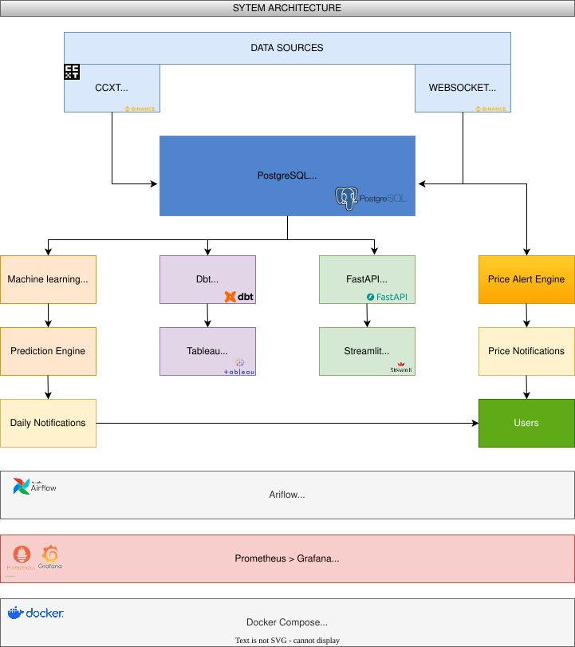
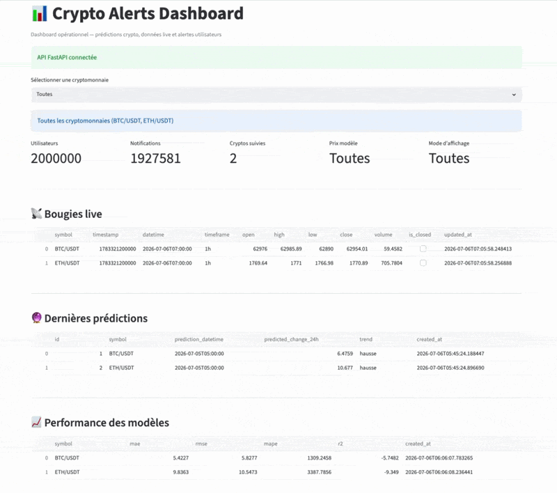
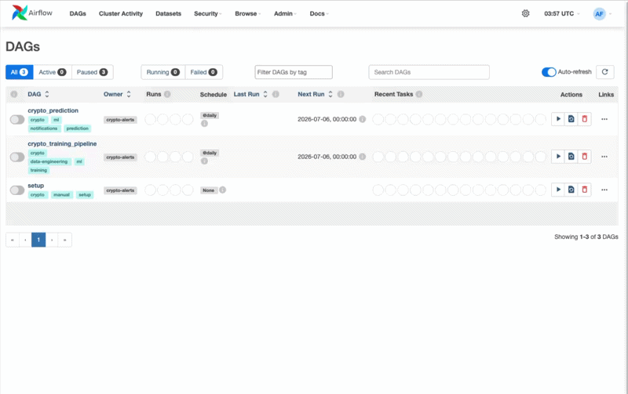

# Crypto Alerts

> Plateforme de **Data Engineering & Analytics Engineering** reproduisant une architecture de production capable de collecter des données historiques et temps réel, d'alimenter des pipelines analytiques et de Machine Learning, puis de générer des prédictions quotidiennes et des alertes personnalisées.


 


## Pourquoi ce projet ?

Crypto Alerts a été conçu pour reproduire une plateforme de données de production couvrant l'ensemble du cycle de vie de la donnée : collecte, stockage, transformation, analyse, prédiction et restitution.

Le projet combine ingestion batch et temps réel, orchestration, automatisation, modélisation analytique, Machine Learning, API REST, monitoring, génération d'alertes.

## Ce que fait la plateforme

- Collecte des **données** historiques avec CCXT
- **Streaming** temps réel via WebSocket
- Stockage **PostgreSQL**
- Feature Engineering des données de marché
- Entraînement et prédiction Machine Learning
- Génération d'alertes personnalisées
- Modélisation analytique avec **dbt**
- **Orchestration** des pipelines avec **Airflow**
- Exposition des données via **FastAPI**
- Visualisation opérationnelle avec Streamlit
- Couche analytique exposée dans des schémas dédiés, consommable par un outil de BI


## Architecture

Le diagramme suivant présente les principaux composants de la plateforme ainsi que les flux de données entre les différents services.

<p align="center">
  
</p>

L'architecture repose sur deux pipelines complémentaires :

- **un pipeline batch**, chargé de collecter les données historiques, de construire les indicateurs techniques, d'entraîner les modèles de Machine Learning et de générer les prédictions quotidiennes ;
- **un pipeline temps réel**, chargé de surveiller en continu les prix des cryptomonnaies et de déclencher les alertes personnalisées lorsque les conditions définies par les utilisateurs sont remplies.


##  Démonstration

<p align="center">
  <a href="assets/gif/streamlit.gif">
    
  </a>
  <br>
  <b>Dashboard Streamlit</b>
</p>

<p align="center">
  <a href="assets/gif/airflow.gif">
    
  </a>
  <br>
  <b>Pipelines Airflow</b>
</p>


## Choix d'architecture

Les principaux choix d'architecture sont les suivants :

- **PostgreSQL** centralise les données opérationnelles et permet d'exécuter les traitements **SQL** au plus près des données.
- **Airflow** orchestre les pipelines de collecte, de transformation, d'entraînement et de prédiction.
- **dbt** construit une couche analytique réutilisable, séparée logiquement des tables opérationnelles par des schémas dédiés (`staging`, `marts`) au sein de la même base PostgreSQL.
- **FastAPI** expose les données, les prédictions et les métriques via une API REST documentée automatiquement.
- **Streamlit** fournit un tableau de bord opérationnel pour le suivi de la plateforme en temps réel.
- La couche analytique est isolée dans les schémas `staging` et `marts`, prête à être interrogée par un outil de BI ou par l'API.
- **Prometheus** collecte les métriques de l'API (endpoint `/metrics`) et des conteneurs via cAdvisor, tandis que **Grafana** assure leur supervision et leur visualisation.
- **Docker Compose** permet de reproduire l'ensemble de l'environnement de développement avec une seule commande.

Cette architecture favorise la séparation des responsabilités, améliore la maintenabilité de la plateforme et facilite son évolution.

## Couche analytique dbt

La couche dbt est organisée en deux niveaux, matérialisés dans des schémas
PostgreSQL distincts de celui des tables opérationnelles :

- `staging` : 9 modèles, un par table brute. Ils renomment l'identifiant
  technique en clé explicite et n'appliquent aucune transformation métier.
- `marts` : 3 modèles métier, agrégés et documentés colonne par colonne
  (34 colonnes décrites).

Les 9 tables brutes sont déclarées comme sources dbt. Le lignage est donc
complet depuis les tables du schéma `public` jusqu'aux marts, aucun schéma
n'est écrit en dur dans les modèles, et `dbt source freshness` est
disponible.

`mart_users` et `mart_crypto` sont matérialisés en table, les 9 modèles de
staging et `mart_notifications` en vue. Les deux marts agrégés balaient
l'intégralité des positions et des alertes : les matérialiser évite de
rejouer l'agrégation à chaque interrogation.

### Les trois marts

`mart_users` : une ligne par utilisateur, matérialisé en table. Profil
(email, pays, devise, langue, fuseau), `cost_basis` (prix de revient du
portefeuille, somme de `buy_price * quantity` sur les positions actives, à
distinguer d'une valeur de marché), `total_positions`,
`total_distinct_symbols`, et les compteurs de préférences d'alertes
quotidiennes et d'alertes de prix. Les trois tables 1-N sont pré-agrégées au
grain `user_id` avant jointure.

`mart_crypto` : une ligne par cryptomonnaie détenue, matérialisé en table.
`total_holders`, `total_positions`, `avg_buy_price`, `avg_quantity`,
`total_cost_basis`, ainsi que les compteurs d'alertes quotidiennes et
d'alertes de prix, dont `triggered_price_alerts` qui s'appuie sur
`triggered_at`. Seuls les symboles présents dans `user_positions`
apparaissent.

`mart_notifications` : une ligne par notification, matérialisé en vue. Type,
statut, dates de création et d'envoi, enrichis du profil géographique du
destinataire, avec les drapeaux `is_sent`, `is_daily_prediction` et
`is_price_target`.

### Tests

Les 72 tests couvrent l'unicité et la présence des identifiants, les
domaines de valeurs adossés aux contraintes `CHECK` de la base, l'intégrité
référentielle sur les clés étrangères déclarées dans le DDL, et l'unicité du
couple `(user_id, symbol)` des préférences d'alertes quotidiennes.

S'y ajoute un test de réconciliation entre un mart et sa source : il compare
`SUM(cost_basis)` issu de `mart_users` à la somme calculée directement sur
`stg_user_positions`, et échoue si l'écart dépasse une tolérance dérivée des
arrondis, `cost_basis` étant arrondi à deux décimales par utilisateur avant
sommation. Le même test vérifie l'égalité exacte entre
`SUM(total_positions)` et le nombre de positions actives. Un second test de
réconciliation compare `mart_users` et `mart_crypto` entre eux, qui agrègent
la même grandeur à deux grains différents, `user_id` d'un côté et `symbol`
de l'autre, avec une tolérance dérivée de leurs arrondis respectifs. Ce sont
les deux seuls tests de la suite dont la réussite ne découle ni d'une
contrainte PostgreSQL, ni de la forme du SQL.

```
$ dbt build

Running with dbt=1.12.0
Found 12 models, 72 data tests, 9 sources, 477 macros
Finished running 2 table models, 72 data tests, 10 view models in 1.33s
Completed successfully
Done. PASS=84 WARN=0 ERROR=0 SKIP=0 NO-OP=0 REUSED=0 TOTAL=84
```

Ce test existe parce qu'il manquait. Un audit du depot a revele que
`mart_users` joignait trois tables 1-N simultanement avant d'agreger :
les `COUNT()` et le `SUM()` portaient sur un produit cartesien, avec un
facteur d'inflation de 2 a 12 selon les utilisateurs. Les 52 tests de la
suite d'alors etaient tous verts — aucun ne pouvait le voir, le `GROUP BY`
garantissant l'unicite de la cle quelle que soit la duplication en amont.
La correction pre-agrege chaque table au grain `user_id` avant jointure,
et a ete validee contre un calcul de reference independant sur les 200 000
utilisateurs, en gardant `COUNT(DISTINCT)` comme temoin de non-regression.

## Observabilité et visualisation

Afin de proposer une plateforme de données complète, le projet intègre également :

- **Streamlit** fournit une interface opérationnelle permettant de suivre les données de marché, les prédictions, les notifications et les principaux indicateurs de la plateforme.
- Les **marts dbt** exposent les données métier (répartition des utilisateurs, composition des portefeuilles, statistiques d'utilisation) dans le schéma `marts`, sous une forme directement interrogeable en SQL.
- **Prometheus** collecte les métriques de l'API (endpoint `/metrics`) et des conteneurs via cAdvisor.
- **Grafana** supervise la plateforme et visualise les métriques techniques.

## Qualité logicielle

Le projet applique plusieurs bonnes pratiques afin d'améliorer sa fiabilité.

- **Pytest** pour les tests unitaires.
- **GitHub Actions** pour automatiser les tests et valider le projet à chaque Push ou Pull Request.


## Points techniques

- Pipelines ETL / ELT modulaires
- Collecte idempotente (upsert `ON CONFLICT`)
- Traitements **SQL-first**
- Batch processing
- Optimisation PostgreSQL (`INSERT ... SELECT`, `ON CONFLICT DO NOTHING`, `FOR UPDATE SKIP LOCKED`)
- Couche analytique avec **dbt**
- DAGs **Airflow** indépendants
- Architecture en services découplés
- API REST documentée avec OpenAPI


## Mesures de performance

Mesures relevées les 6 et 24 août 2026, en local (macOS, Docker Desktop,
nœud unique), à l'échelle de **200 000 utilisateurs générés**. Les volumes
en base croissent mécaniquement, les DAGs `@daily` régénérant environ
372 000 notifications par jour :

- Build Docker complet from scratch (`--no-cache`) : **90 s**, 16 services
  (dépendances épinglées incluses)
- Base PostgreSQL : **~2,4 M de lignes / 473 MB** (10 tables)
- Génération d'utilisateurs : **200 000 utilisateurs en 77 s**, soit
  **1 407 243 lignes** au total (utilisateurs + positions + préférences +
  alertes) à **~18 300 lignes/s** en batch processing
- Alertes de prix générées : **361 810** à cette échelle
- Ingestion batch : 180 jours × 2 symboles (**8 640 bougies**) en **8,0 s**
- Notifications quotidiennes : **372 503 en 6,2 s** en SQL pur
  (`INSERT ... SELECT`)
- Stream d'alertes : **2 994 notifications/s** en résorption de backlog,
  batchs de 5 000 commités en **~90 ms** (`FOR UPDATE SKIP LOCKED`)
- API : **p95 de 2 à 39 ms** selon l'endpoint, mesuré avec 553 000
  notifications en base
- dbt : 12 modèles, 72 tests, 9 sources, **84/84 PASS**

Aucun chargement massif des alertes en mémoire Python : les traitements
volumineux sont délégués à PostgreSQL.

### Machine Learning : un résultat assumé

Les performances prédictives mesurées sont mauvaises, et c'est documenté
volontairement : **R² de −0,48 (BTC/USDT) et −2,65 (ETH/USDT)** sur un
split chronologique 80/20 — le modèle RandomForest est battu par une
baseline constante à zéro sur les deux symboles. Prédire le marché crypto
à 24 h avec des indicateurs techniques simples ne fonctionne pas, et ce
projet ne prétend pas le contraire.

Le composant ML sert à démontrer le **cycle MLOps complet** : entraînement,
évaluation champion/challenger sur un jeu de test commun, promotion
conditionnelle du modèle, archivage des versions et historisation des
métriques (MAE, RMSE, MAPE, R²) en base — c'est précisément cette
instrumentation qui permet de mesurer honnêtement les limites du modèle.


## Évolutions prévues
- Déploiement Cloud
- Validation automatique des modèles
- Notifications Email et SMS
- Amélioration de la couverture de tests
- Amélioration de Dbt

## Stack technique

- Python
- PostgreSQL
- Docker Compose
- Airflow
- dbt
- FastAPI
- Streamlit
- Prometheus
- Grafana
- GitHub Actions
- Pytest
---


## Lancer le projet

### 1. Configuration

Les fichiers de configuration `.env` ne sont pas versionnés et sont exclus du dépôt via `.gitignore`.

Avant de lancer le projet, créer les fichiers `.env` à partir des modèles fournis :

```bash
cp .env.exemple .env
cp .env.docker.exemple .env.docker
```

Modifier ensuite les variables d'environnement selon votre configuration si nécessaire.

### 2. Démarrer l'environnement Docker

Cette commande lance les services principaux du projet et initialise automatiquement les tables de la base PostgreSQL.

L'option `--no-cache` n'est utile qu'au premier build ou après un changement de dépendances ; un `docker compose build` simple suffit ensuite.

```bash
docker compose --env-file .env.docker build --no-cache
docker compose --env-file .env.docker up -d
```
Vérifier que l'initialisation de la base s'est correctement déroulée : 
```bash
docker logs crypto_init_db 
```
Le message suivant doit être affiché :
"Base de données initialisée avec succès."

### 3. La génération des utilisateurs se fait manuellement : 
```bash
docker compose --env-file .env.docker run --rm pipeline python users_db/generate_fake_users.py <nombre d'utilisateurs souhaités>
```

**Exemple:**
```bash
docker compose --env-file .env.docker run --rm pipeline python users_db/generate_fake_users.py 200000
```


### 4. Accéder à l'interface Airflow puis lancer le DAG `setup` pour Collect > Features Engineering > Train > Predict

http://localhost:8080

### 5. La partie analytics est optionnelle. Pour lancer dbt : 
```bash
docker compose --env-file .env.docker --profile manual run --rm dbt dbt debug
docker compose --env-file .env.docker --profile manual run --rm dbt dbt run
docker compose --env-file .env.docker --profile manual run --rm dbt dbt test
docker compose --env-file .env.docker --profile manual run --rm dbt dbt docs generate
```

Services utiles:

- API FastAPI      : http://localhost:8000
- Streamlit        : http://localhost:8501
- Airflow          : http://localhost:8080
- pgAdmin          : http://localhost:5050
- Prometheus       : http://localhost:9090
- Grafana          : http://localhost:3000